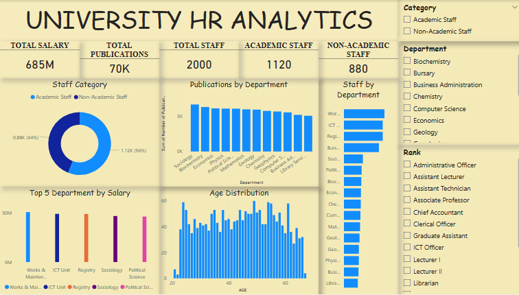

# University Staff Salary & Workforce Analytics
## 🧾 Overview
This project analyzes university staff data to uncover insights into salary distribution, workforce structure, and research output across academic and non-academic departments.
Data was extracted from a raw document, analyzed in Power BI, and presented with actionable insights.
## 🎯 Key Focus Areas
1. Total Salary & Staff Count
2. Academic vs Non-Academic Distribution
3. Staff & Publications by Department
4. Top 5 Departments by Salary
5. Age Distribution of Staff
## 🛠️ Tools
1. Microsoft Word
2. Power BI
## 📈 Dashboard

## 💡 Insights
Salary is heavily concentrated among academic staff
A few departments dominate in both staff size and salary allocation
Research output is uneven across departments
Age distribution highlights workforce planning needs
## 📌 Conclusion
This project highlights how data can support better workforce planning, salary structuring, and strategic decision-making in university management.

